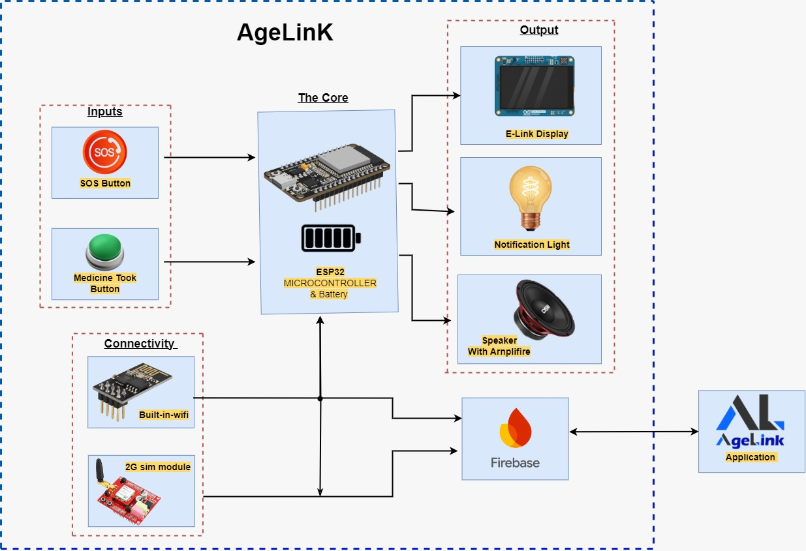

# AgeLink 🧓🔗 - Hardware & Firmware
**Empowering independent elderly living through voice-assisted IoT.**

**Team:** Team XTurbo  
**Domain:** Healthcare & Elderly Care  

---

## 🛠️ Tech Stack Used
* **Microcontroller:** ESP32-WROOM-32 (or ESP32-S3)
* **Audio Output:** MAX98357 I2S Amplifier & 5W Speaker
* **Inputs:** Tactile Emergency SOS Button, "Medicine Taken" Button
* **Firmware / Language:** C++ (Developed in Arduino IDE)
* **Cloud Communication:** Firebase ESP32 Client Library (Wi-Fi connected)

---

## 🚀 Deployment Details
This code is designed to run directly on an ESP32 microcontroller. 
1. Open the `.ino` file in the Arduino IDE.
2. Ensure you have the **ESP32 Board Manager** installed.
3. Install required libraries: `Firebase ESP32 Client`, `WiFi`, and any specific I2S audio libraries you utilized.
4. **Environment Variables:** Update the `WIFI_SSID`, `WIFI_PASSWORD`, and Firebase credentials at the top of the main script (or in the associated `.env` / config file) before flashing the code to the board via USB.

---

## 📐 Architecture / System Overview

**System Diagram:**

**Short Explanation:**
The AgeLink hardware acts as the physical touchpoint for the elderly user. 
1. The **ESP32** serves as the core processor, managing the **SIM module** for cellular connectivity and maintaining a Wi-Fi connection to our Firebase backend.
2. It continuously listens for state changes on the **Tactile SOS Button**. If pressed, it utilizes the integrated **SIM module** to immediately ring the primary emergency contact number configured by the family member. Simultaneously, it triggers an immediate write to Firebase, which the companion app picks up to send additional push alerts to the rest of the family.
3. For medication reminders, the ESP32 downloads schedule data from Firebase. At the scheduled time, it uses the **MAX98357 I2S Amplifier** to output high-quality voice reminders through the speaker.

---

## 🧠 Technical Challenges & Creative Solutions

1. **Clear Voice Playback on Microcontroller:** 
   * **Challenge:** Generating clear, understandable human voice audio directly from an ESP32 without distortion. 
   * **Solution:** We integrated a MAX98357 I2S digital-to-analog amplifier instead of a basic PWM buzzer, ensuring the voice reminders are loud and clear enough for elderly users with hearing difficulties.

2. **Always-On Reliability (Offline Mode without Hardware RTC):**
   * **Challenge:** Ensuring medication reminders still trigger if the user's home Wi-Fi drops, without increasing the device cost by adding an external hardware Real-Time Clock (RTC) module.
   * **Solution:** The ESP32 is programmed to synchronize its time via the internet (NTP) when connected and cache the daily schedule locally. If the Wi-Fi connection drops, the device intelligently falls back on the ESP32's internal system timer to keep track of the time. This allows scheduled reminders to function independently until the connection is restored.

---

## ✅ Scope Delivered

* **Fully Implemented:** 
  * Wi-Fi connectivity and Firebase real-time database synchronization.
  * Physical SOS button integration with instant cloud-triggering.
  * 2G SIM Module Integration: The hardware successfully utilizes the SIM module to immediately ring a designated emergency number when the SOS button is pressed.
  * Audio playback pipeline (ESP32 to I2S Amplifier to Speaker).
* **Partially Implemented / Future Scope:**
  * Dynamic downloading of new voice files: Currently, standard voice prompts are used. Dynamic fetching of custom family voice notes from Firebase Storage is planned for the next phase.

---

## 📝 Note
* **Hardware Requirements:** To fully execute and test this codebase, judges would need the exact physical hardware setup (ESP32, MAX98357, Speaker, and Tactile Button) wired according to our provided schematic. 
* **Cost Efficiency:** The entire hardware setup was strictly optimized to keep the production cost under LKR 8,500, aligning with our goal to make elderly care affordable for developing nations.

---

## 🎥 Demonstration Video Link
**[Insert YouTube / Drive Link to your 360° Hardware Demo Video Here]**
